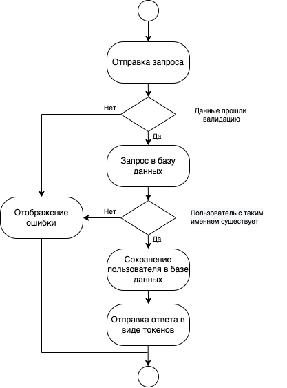
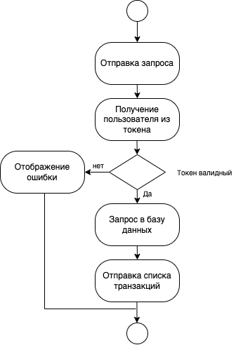
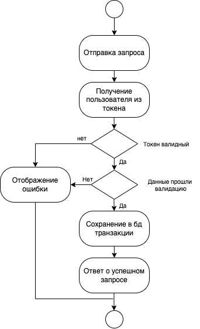
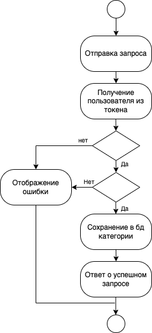

# Диаграммы активности

# Содержание
1. [Регистрация](#register)
2. [Вход](#sign_in)
3. [Просмотр транзакций](#show_transactions)
4. [Создание транзакции](#create_transaction)
5. [Создание категории](#create_category)

<a name="register"/>

# 1. Регистрация

<a name="sign_in"/>

# 2. Вход

<a name="show_transactions"/>

# 3. Просмотр транзакций

<a name="create_transaction"/>

# 4. Создание транзакции

<a name="create_category"/>

# 5. Создание категории

