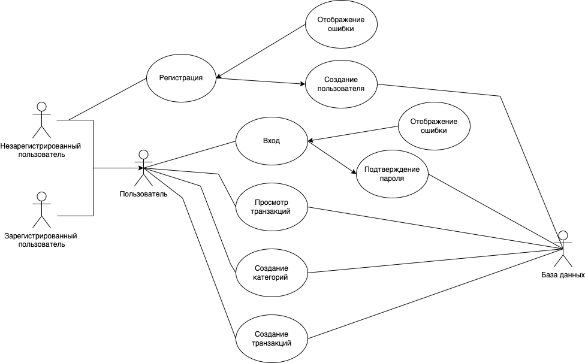

# Поток событий

---

# Содержание
1 [Актёры](#actors)  
2 [Варианты использования](#use_case)  
2.1 [Регистрация](#register)  
2.2 [Вход](#sign_in)  
2.3 [Просмотр всех транзакций](#show_all_transactions)  
2.4 [Создание транзакции](#create_transaction)  
2.5 [Создание_категории](#create_category)  

<a name="actors"/>

# 1 Актёры

| Актёр                           | Описание                                                     |
|:--------------------------------|:-------------------------------------------------------------|
| Анонимный пользователь          | Пользователь, который не хочет регистрироваться в приложении |
| Зарегистрированный пользователь | Пользователь, который вошел в приложение с помощью токена    |
| Админ                           | Супер пользователь                                           |
| База данных                     | База данных, хранящая информацию о транзакциях и категориях  |

<a name="use_case"/>

# 2 Варианты использования

Use Case диаграммы приложения "СA Manager API":

<a name="register"/>

## 2.1 Регистрация
**Описание.** Вариант использования "Регистрация" позволяет пользователю
зарегистрироваться в приложении.  

1. Вариант использования начинается, когда пользователь отправил соответствующий POST запрос на сервер.
2. В Body Post запроса пользователь должен передаль логин, пароль, фамилию и имя .
3. Сервер выполняет запрос в базу данных на проверку существования пользователя с таким
именем.
4. Если пользователь с таким именем уже существует, приложение выводит сообщение 
об ошибке.
5. Если данные пользователя проходят валилдацию в базе данных создается пользователь, 
ответом на запрос отправляются токены.
6. Конец варианта использования. 

<a name="sign_in"/>

## 2.2 Вход

**Описание.** Вариант использования "Вход" позволяет пользователю войти в приложение.  
**Предусловия.** Пользователь уже прошел вариант использования "Регистрация".

1. Пользователь отправляет Post запрос содержащий логин и пароль.
2. Приложение выполняет запрос в базу данных на проверку существования пользователя с таким
именем.
3. Если пользователя с таким именем не существует или пароль неверный, сервер
отправляет сообщение об ошибке и переходит к пункту 1.
4. Сервер отправляет пользователю токен.
5. Конец варианта использования. 

<a name="show_all_transactions"/>

## 2.3 Просмотр всех транзакций

**Описание.** Вариант использования "Просмотр всех транзакций" позволяет пользователю
получить список всех транзакций, созданных им.
  
1. Пользователь отправляет запрос на сервер.
2. Ответом получает Json со всеми транзакциями.
3. Также пользователь может указать параметры для фильтрации в запросе.

<a name="create_transaction"/>

## 2.4 Создание транзакции 
 **Описание.** Вариант использования "Создание транзакции" позволяет пользователю 
 создать транзакцию.

1. Пользователь отправляет соответствующий Post запрос на сервер.
2. В базе данных сохраняется транзакция.
3. Ответом от сервера является код 201, оповещающий о успешном создании транзакции.

<a name="create_category"/>

## 2.5 Создание категории

**Описание.** Вариант использования "Создание категории" позволяет
пользователю создать собственную категорию.  

1. Пользователь отправляет Post запрос на сервер.
2. В пост запросе указывая данные необходимые для создания категории.
3. В базе данных сохраняется категоря.
4. Ответом от сервера является код 201, оповещающий о успешном создании категории.
